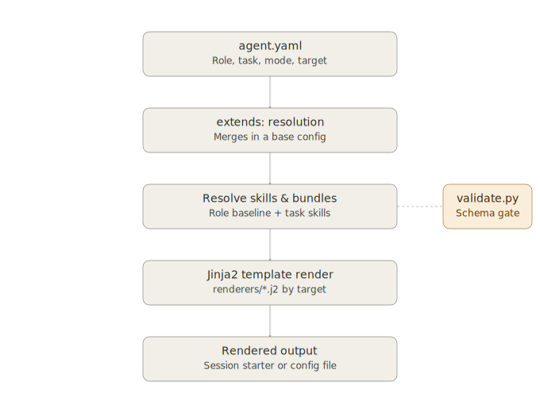

# How the constraint-kit engine works

Team training material. This is the internals doc — it explains how
`render.py`, `validate.py`, and the schema fit together, so the kit
stops being a black box. If you just want to *use* constraint-kit, see
[`GETTING_STARTED.md`](GETTING_STARTED.md) instead. This doc is for
anyone who needs to debug it, extend it, or explain it to someone else.

Everything here is verified directly against the current source in
`bootstrap/` and `schema/` — no invented behavior.

## The three-layer schema

Everything constraint-kit knows about how to constrain an AI session
lives in three kinds of YAML file:

**Skills** (`skills/<skill-id>/meta.yaml` + `SKILL.md`) — a single
constraint, atomic and self-contained. `test-driven-development` is a
skill. It has a `meta.yaml` (id, description, which modes it applies
to, which personas, provenance if adapted from elsewhere) and a
`SKILL.md` (the actual instructions the AI reads).

**Roles** (`schema/roles/<role-id>.yaml`) — a persona's baseline skill
set, broken out by mode. The `engineer` role, for example, requires
`decision-records` in every mode, plus `test-driven-development` and
`systematic-debugging` specifically when the mode is
`generating-code`. A role is really just a lookup table: given a mode,
which skills are required and which are recommended.

**Bundles** (`bundles/<bundle-id>.yaml`) — a named group of skills for
a common situation, like `new-feature-design`, which pulls in
`brainstorming`, `requirements-gathering`, and `decision-records`
together. Bundles exist so a person doesn't have to remember which
three or four skills go together for "I have an idea and need to plan
it out."

`registry.yaml` is the master index over all three — every skill,
role, and bundle must have an entry there or it's invisible to the
renderer's `--list` command (though it can still be loaded directly by
id if referenced correctly elsewhere).

## The compile pipeline

`render.py` is the engine. It reads one `agent.yaml`, resolves which
skills apply, and produces one rendered output file. As a pipeline:



Walking each stage:

**1. `agent.yaml`** — your project's declared role, task, mode, and
target, plus any optional `task_skills`, `bundles`, `suppress_skills`,
or `extension`.

**2. `extends:` resolution** — *(optional, only if the field is set)*
`load_agent_with_base()` merges your `agent.yaml` on top of a base
file. This is a separate mechanism from `extension:` — see the
callout below, they're easy to confuse.

**3. Resolve skills & bundles** — `resolve_skills()` builds two sets:
`required` and `recommended`. It starts with the role's `all_modes`
baseline, adds the role's mode-specific skills for whatever `mode` is
active, adds any `task_skills`, merges in every skill from every
listed `bundle`, then removes anything in `suppress_skills`. Finally
it discards from `recommended` anything that's already `required`, so
a skill never shows up twice.

**4. Jinja2 template render** — the target (`session-prompt`,
`copilot-instructions`, `active-task-md`, or `skill-md`) selects one of
the four templates in `bootstrap/renderers/`. The resolved role, task,
mode, and skill lists get passed into that template as context and
rendered to text.

**5. Rendered output** — printed to stdout by default, or written to
a target-specific file path with `--write` (`session-starter.md`,
`.github/copilot-instructions.md`, `active-task.md`, or `SKILL.md`
depending on target).

### `extends:` vs `extension:` — don't confuse these

They sound alike and do completely different things:

- **`extends:`** (in `agent.yaml`) merges your config with a *base
  agent.yaml* — same project, layered config. Scalars and lists from
  your file override the base; `session_history` concatenates instead
  of overriding. Handled by `load_agent_with_base()` in `render.py`.
- **`extension:`** (also in `agent.yaml`) points at a *separate
  manifest* of org- or domain-specific skills and roles that live
  outside the core constraint-kit library — e.g. a private repo.
  Handled by `load_extension_index()`. Skills and roles from an
  extension are looked up *before* falling back to the core
  `skills/`/`schema/roles/` directories, so an extension can override
  a core skill id if it needs to.

If something isn't rendering the skills you expect, check which of
these two fields is actually set in the `agent.yaml` you're debugging
— it's easy to assume one when the other is in play.

## The validation gate chain

`validate.py` is what keeps the schema internally consistent. It
enforces ten rules (run `python validate.py --explain` for the live,
current list — this is a snapshot, not the source of truth):

| Rule | Why it matters |
|---|---|
| id must match filename/directory | The renderer locates files by id — a mismatch is a silent load failure |
| `schema_version` must be current | Lets the validator detect stale files during schema transitions |
| Modes must be from the valid set | Arbitrary mode names break skill resolution — those skills are simply never loaded |
| At least two tags required | Tags drive discovery; too few makes a skill hard to find |
| Personas must be from the valid set | Personas filter which skills/roles surface per user type |
| `doc_type` recommended for `generating-doc` | Gives the renderer sub-type context; auto-fixable |
| `SKILL.md` needs Purpose/Anti-Patterns/Transition | Transition specifically prevents context drift between skills |
| Role/bundle skill references must resolve | An unresolvable id crashes the renderer or produces incomplete output |
| Registry must match disk | Anything on disk with no registry entry is invisible; auto-fixable |
| Provenance block complete for adapted skills | Ensures attribution and upstream-diff tracking stay possible |

Run modes:

```bash

python validate.py                  # validate everything
python validate.py --fix            # auto-fix safe mechanical issues
python validate.py --fix --dry-run  # preview fixes without writing
python validate.py --explain        # print the full rule list with reasoning
python validate.py --json           # machine-readable output, for CI
python validate.py --file path/to/file.yaml   # validate one file

```

This is wired into CI: `.github/workflows/validate.yml` runs on every
push and PR to `main` that touches `skills/`, `schema/`, `bundles/`,
`registry.yaml`, or `bootstrap/`. A schema violation fails the check
before it ever reaches a teammate's render.

## Worked example: tracing one skill end to end

Take a concrete case — an `agent.yaml` with `role: engineer`,
`mode: generating-code`, `target: session-prompt`, no extras. Here's
exactly how `test-driven-development` ends up in your session starter:

1. **Role lookup**: `render.py` loads `schema/roles/engineer.yaml`.
2. **Mode resolution**: because `mode` is `generating-code`, it reads
   `skills.generating-code.required`, which lists
   `test-driven-development` and `systematic-debugging`. It also reads
   `skills.all_modes.required`, which adds `decision-records`
   regardless of mode. Required set: `{decision-records,
   test-driven-development, systematic-debugging}`.
3. **Skill load**: for each id in that set, `load_skill()` opens
   `skills/test-driven-development/meta.yaml`, reads its description,
   modes, tags, provenance (this one's adapted from
   `obra/superpowers`, tracked with `source_repo`, `source_url`, and
   `adapted_date`), and attaches a `portable_path()`-resolved path to
   the actual `SKILL.md`.
4. **Template render**: `session-prompt.j2` receives the resolved
   `skills` list in its Jinja2 context and renders each one into the
   "Constraints Active for This Session" section of the output.
5. **Output**: printed to stdout, or written to
   `.constraint-kit/session-starter.md` with `--write`.

That `portable_path()` step is worth calling out on its own — it's a
small function, but it's the kind of thing that causes confusing bugs
if you don't know it exists.

### Why `portable_path()` exists

`render.py` needs to embed a file path in its output — so the AI
assistant (or a human) knows where to go look up the full skill text.
The naive approach, an absolute path, bakes in `/home/<username>/...`,
which breaks the moment the output is shared with anyone else or
committed to a repo other people clone. `portable_path()` returns a
`~/`-relative path when the file is inside the current user's home
directory, and falls back to an absolute path otherwise. It's a small
function, but it's exactly the kind of detail that separates "output
that only works on my machine" from "output that works for the team."

This matters here specifically because of a historical bug: extension
manifest skill paths were, at one point, not being resolved through
`portable_path()` at all — only core-kit paths were. If you're ever
debugging why a rendered session starter has an absolute
machine-specific path in it for an extension skill but a clean `~/`
path for a core skill, that class of bug is exactly what to suspect.

## Session outline (for delivering this as a live training)

Roughly 30–40 minutes:

1. **The problem** (5 min) — drift, and why "rules on disk, not in
   memory" fixes it structurally. (See `README.md` — Philosophy.)
2. **The three-layer schema** (5 min) — skills, roles, bundles, with
   `engineer.yaml` and `test-driven-development` on screen.
3. **The compile pipeline** (10 min) — walk the diagram above stage by
   stage, live in the terminal: `python render.py --list`, then render
   a real `agent.yaml` and look at the output.
4. **`extends:` vs `extension:`** (5 min) — the distinction above,
   plus why it's a common point of confusion.
5. **The validation gate chain** (5 min) — `python validate.py
   --explain` live, then `python validate.py --fix --dry-run` on a
   file with a deliberate issue.
6. **Worked example** (5–10 min) — trace `test-driven-development`
   from `engineer.yaml` through to rendered output, as above.
7. **Q&A / open floor**

Capture notes or a recording and link them from here once delivered.
