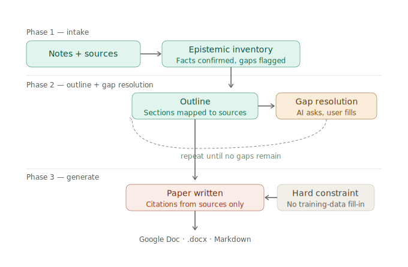

# Research synthesis workflow

A constraint-kit pattern for writing a paper from provided notes and
sources, with an AI surface acting as synthesizer rather than knowledge
generator. The AI is constrained to only what you bring — it flags gaps
and asks before it writes.

## Phase diagram



## What this workflow does

You bring notes, sources, and an audience. The AI surface acts as a
synthesis engine — it does not generate facts from its own training
knowledge. It constructs the paper exclusively from what you provide,
and it tells you explicitly when it cannot.

The three phases run in sequence in a single session:

**Phase 1 — Intake.** The AI reads your notes and source inventory and
produces an explicit epistemic inventory: what facts are confirmed,
what sources are available, and what claims are flagged as uncertain
or unsourced in your own notes.

**Phase 2 — Outline and gap resolution.** The AI proposes a paper
structure for your stated audience. For each section it lists the
facts and sources that support it. Any section lacking sufficient
cited material is flagged. The AI asks before proceeding — it does
not write around gaps. This phase loops until every gap is either
resolved by user input or explicitly scoped out.

**Phase 3 — Generate.** With all gaps resolved, the AI writes the
paper using only cited materials. Every assertion is tied to a source.
Author conclusions are labelled as such and distinguished from cited
findings.

## The epistemic constraint

This is the core rule the AI must follow in every phase:

> Assert only what appears in the provided notes or in a source
> marked as available. When a claim cannot be sourced to provided
> materials, say so and ask. Do not use training knowledge to fill
> gaps.

Common anti-patterns to watch for and reject:

- "It is generally understood that…" — no source, refuse to proceed
- Citing a reference but asserting facts not in the provided text
- Proceeding to Phase 3 with unresolved gaps affecting the argument
- Using contested figures without flagging the contestation

## The `agent.yaml` config

```yaml

project: my-paper
role: researcher
mode: collaborating
task: >
  Read notes.md and sources.yaml. You are a research synthesizer.
  Assert only what appears in notes.md or a source marked
  full_text_provided: true. For sources marked false, cite the
  reference only for facts also stated in notes.md. Do not draw
  on training knowledge to fill factual gaps. When something is
  missing, flag it and ask.

  Run three phases in order:
    Phase 1 — Epistemic inventory: confirmed facts, available
              sources, uncertain or unsourced claims.
    Phase 2 — Outline: paper structure for stated audience.
              Flag every section lacking sufficient cited material.
              Do not proceed to Phase 3 until gaps are resolved.
    Phase 3 — Generate the paper with inline footnote citations.

target: session-prompt
task_skills:
  - research-brief
  - document-structure
  - plain-language
  - argument-construction
epistemic_constraint: >
  HARD CONSTRAINT: Do not assert any fact not present in notes.md
  or in a full_text_provided: true source. When a claim cannot be
  sourced to provided materials, say so explicitly and ask.
  Never use training knowledge to fill factual gaps.

```

## The `notes.md` structure

Provide your notes in sections that map directly to what the AI
needs to work with:

```markdown

# Working notes — [topic]

## Facts I want to establish

- Claim. Source: [source name, year]. NOTE: any caveats.
- ...

## Things I am not sure about / need to check

- Open question 1
- Open question 2

## Intended argument

One paragraph stating the thesis.

## Audience

Who will read this. Tone, assumed knowledge, sensitivities.

```

## The `sources.yaml` structure

```yaml

sources:
  - id: SOURCE-ID
    title: "Full title"
    author: "Author or org"
    year: 2024
    url: "https://..."
    notes: "Any caveats about this source"
    full_text_provided: true   # or false — citation only

```

Mark `full_text_provided: false` when you have the citation but not
the full text. The AI will cite the reference but may only assert
facts that also appear in your notes.

## Output path

When Phase 3 is complete, ask the AI to format for your target:

| Format | How |
|---|---|
| Google Doc | Copy Markdown output, paste into a new Doc, use Format → Convert to Google Docs formatting |
| `.docx` | `pandoc -o paper.docx paper.md` |
| Markdown | Keep as-is; version-control friendly, diff-able |

## New skill for `registry.yaml`

Add this to make the epistemic constraint automatic for any
`role: researcher` session:

```markdown

# Skill: source-constrained-synthesis

## Purpose

Constrain AI synthesis to only provided materials. Eliminate
training-data fill-in. Make gaps explicit before writing begins.

## When this skill is active

Any session producing a paper, brief, or report where the AI
must not go beyond what the user has supplied.

## Agent behavior

- Produce an explicit epistemic inventory before outlining.
- Assert only what appears in notes or full_text_provided sources.
- Flag every unsourced claim in notes as uncertain.
- Ask before proceeding when a section lacks citation support.
- Never write around a gap using assumed knowledge.

## Anti-patterns

- Citing training knowledge as if it were a provided source.
- Proceeding to Phase 3 with unresolved gaps that affect the argument.
- Asserting contested figures without flagging the contestation.
- Using "it is generally understood that…" to fill sourcing holes.

## Transition

Phase 2 → Phase 3 only after the user has explicitly resolved
all flagged gaps.

```
