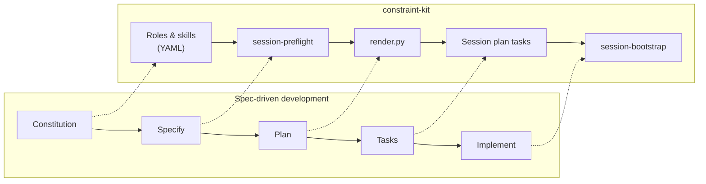
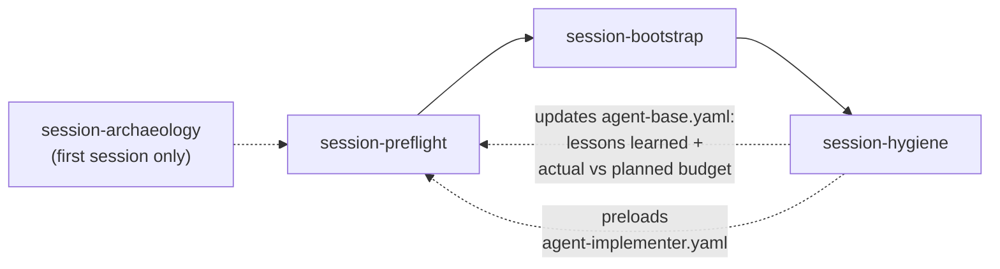

# constraint-kit and Spec-Driven Development

constraint-kit implements the same five-stage shape as canonical
Spec-Driven Development (SDD) — Constitution, Specify, Plan, Tasks,
Implement — but backs each stage with a concrete artifact and tool
rather than a generic document.

## Stage mapping

| SDD stage        | constraint-kit equivalent      | What it produces |
|-------------------|-------------------------------|-------------------|
| Constitution       | Roles & skills (YAML)          | Schema-validated role/skill/bundle definitions — the intent layer |
| Specify             | `session-preflight`            | `SESSION_PLAN.md` — the session's spec + acceptance checklist |
| Plan                | `render.py`                    | Compiled skill bundle (architecture/composition decisions) |
| Tasks                | Session plan tasks            | Granular, context-sized steps inside `SESSION_PLAN.md` |
| Implement            | `session-bootstrap`            | AI execution against the compiled bundle, enforced by `validate.py` / `make gate` |

One divergence worth calling out: SDD's feedback loop ("requirements
change → update spec → regenerate") is *drift-triggered* — it fires
when something changes mid-project. constraint-kit's session loop
below is *completion-triggered* — it fires every session, drift or
not.

## Session lifecycle and the hygiene loop

A session runs `session-preflight` → `session-bootstrap`
(implementation) → `session-hygiene` (close). `session-archaeology`
is an optional step ahead of preflight, used only when starting from
an existing, undocumented repo — it is not part of the recurring
loop.

`session-hygiene` carries two things forward into the next session's
preflight:

- **`agent-base.yaml` updates** — lessons learned during the session,
  plus actual effort spent against what was planned.
- **A preloaded `agent-implementer.yaml`** — set up automatically so
  the next session's implementer role doesn't need to be reconstructed
  from scratch.

### Worked example: ck-docs S01

The `ck-docs` project's own `SESSION_PLAN.md` shows this in practice.
Session S01 (scaffolding) closed with concrete lessons that would
feed forward under this scheme:

- `validate.py --file` only dispatches on `skills/`, `roles/`, and
  `bundles/` path parts — `.constraint-kit/` files are out of scope.
- Artifact filenames use hyphens throughout (`agent-base.yaml`, not
  `agent_base.yaml`).
- Skill injection requires an `extension:` field at the top level
  pointing at `ck-personal/constraint-kit.yaml`, and a `task_skills:`
  field (not `skills:`) listing skill IDs — `path:` entries and a bare
  `skills:` field are silently ignored by `render.py`.
- Tooling lives in `~/constraint-kit/bootstrap/`, not `tools/`.

S02+ (the content sessions that would generate `docs/02-*.md` through
`docs/10-*.md` using this same process) haven't run yet — this file
was written outside that pipeline as a starting point.
