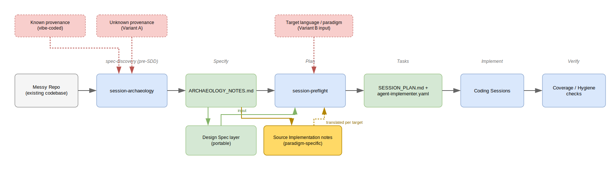

# Session archaeology — deconstructing an undocumented repo before rebuilding it

A constraint-kit scenario demonstrating what happens when a rebuild is
planned straight from human memory of a messy repo, versus planned
after `session-archaeology` has actually read it. Same repo, same
rebuild goal — the difference is whether the spec `session-preflight`
works from is grounded in the artifact or in what the human happens
to remember about it.



## The codebase context

A small vibe-coded poller, the kind of thing that accretes across a
few AI-assisted sessions without anyone doing a refactor pass. Small
enough to read in full.

### Repo structure

```

legacy-poller/
├── poller.py
└── tests/
    └── test_poller.py

```

### `poller.py`

```python

"""Polls a set of service endpoints and alerts if any are down."""
import json
import time
import requests

class Poller:
    def __init__(self, config_path):
        with open(config_path) as f:
            self.config = json.load(f)
        self.session = requests.Session()
        self.session.headers.update(
            {"Authorization": f"Bearer {self.config['token']}"}
        )

    def check(self, url):
        try:
            r = self.session.get(url, timeout=5)
            if r.status_code != 200:
                self._alert(url, r.status_code)
        except Exception as e:
            self._alert(url, str(e))

    def _alert(self, url, detail):
        print(f"ALERT: {url} - {detail}")

    def legacy_retry(self, url, attempts=3):
        # older retry path, superseded by check()'s error handling
        for i in range(attempts):
            try:
                r = self.session.get(url, timeout=5)
                if r.status_code == 200:
                    return True
            except Exception:
                time.sleep(1)
        return False

    def run(self):
        while True:
            for url in self.config["urls"]:
                self.check(url)
            time.sleep(self.config.get("interval", 30))

```

### `tests/test_poller.py`

```python

def test_check_alerts_on_non_200(capsys):
    poller = Poller.__new__(Poller)  # bypass __init__ — it does file + network I/O
    poller.session = FakeSession(status=500)
    poller.check("http://example.com")
    assert "ALERT" in capsys.readouterr().out

```

One passing test. It has to bypass `__init__` entirely with
`Poller.__new__` to avoid touching disk and the network — the test
author routed around the constructor rather than through it.
`legacy_retry()` is never called by `run()`. Neither fact is visible
without reading both methods against each other.

## Without `session-archaeology`

**The prompt to `session-preflight`:**

> This poller is kind of a mess, let's rebuild it. TDD, aim for
> >95% coverage. I think there's a retry thing in there we should
> keep.

`session-preflight` doesn't read the target repo — by design, all
context comes through intake questions. The human is answering from
memory of code they didn't write carefully the first time:

| Intake question | Answer from memory |
|---|---|
| Done condition | "Rebuilt, TDD, high coverage" |
| Scope | "Same as before, just cleaner" — `legacy_retry` mentioned as something to keep |
| Constraints | None specific — "just make it testable" |

**What lands in `agent-implementer.yaml`:**

```yaml

constraints:
  - Write testable code
  - Keep the retry logic

```

Generic. Nothing here identifies *why* the original was hard to test,
so nothing prevents the same shape recurring. `legacy_retry` — dead
code that was never reachable from `run()` — becomes a requirement
because it's the one detail the human happened to recall.

## With `session-archaeology`

Run first, before `session-preflight`. Mode: KNOWN PROVENANCE — the
user can state this was built across successive vibe-coding sessions.

**Discovery passes over the actual repo:**

- **Structural inventory** — one class, three public methods, one
  private. `run()` calls `check()`; nothing calls `legacy_retry()`.
- **Behavior contract** `[V]` — the one passing test confirms `check()`
  alerts on non-200 responses via `print`.
- **Feature inventory** — `legacy_retry` traced against every call
  site in the repo: unreachable. Marked Deprecate.
- **Flaw taxonomy:**

| Flaw | Category | Evidence | Confidence | Root cause |
|---|---|---|---|---|
| `__init__` does file + network I/O | Testability | Test has to bypass the constructor with `__new__` to run at all | V | Config/session setup bolted directly into the constructor — consistent with fast iteration under vibe-coding, no refactor pass since |
| Request-building duplicated in `check()` and `legacy_retry()` | Duplication | Both build `self.session.get(url, timeout=5)` independently | I | Consistent with `legacy_retry` predating `check()`, left in place rather than merged when `check()` was added |

- **Preserve vs. deprecate** — preserve: `check()`'s alert-on-non-200
  behavior (test-verified). Deprecate: `legacy_retry` (unreachable).

**What lands in `agent-implementer.yaml`** after `session-preflight`
consumes `ARCHAEOLOGY_NOTES.md`:

```yaml

constraints:
  - "No I/O (file or network) in __init__ — inject config and the
     HTTP session as constructor parameters or via a factory function"
  - "Do not carry forward legacy_retry — confirmed unreachable in the
     source repo, superseded by check()'s error handling"

```

Specific, and traceable back to evidence rather than to what someone
happened to remember.

## What archaeology prevented

| Risk without archaeology | What archaeology caught |
|---|---|
| `legacy_retry` misremembered as needed, carried into the rebuild as a requirement | Feature inventory traced every call site — confirmed unreachable, marked Deprecate |
| Generic "make it testable" constraint, root cause unaddressed — same coupling likely to recur | Root cause identified (I/O in `__init__`) → specific, checkable constraint written directly into `agent-implementer.yaml` |
| Duplicated request-building logic invisible without reading both methods side by side | Flagged explicitly in the flaw taxonomy with evidence cited |

## Skill files

`session-archaeology` is already wired into the registry — see
`../skills/session-archaeology/SKILL.md`,
`../skills/session-archaeology/meta.yaml`, and the corresponding
entry in `../registry.yaml` (paired bidirectionally with
`session-preflight`).

## Related docs

- [`sdd_relationship.md`](sdd_relationship.md) — where
  `session-archaeology` sits in the session lifecycle and how it maps
  onto the Spec-Driven Development pipeline (Specify/Plan/Tasks/
  Implement/Verify).
- [`session-archaeology-use-case.md`](session-archaeology-use-case.md) —
  the fuller concept doc: unknown-provenance repos (no known build
  process to anchor root-cause tagging), and cross-language/paradigm
  transposition (rebuilding the same design spec in a different
  target language).
