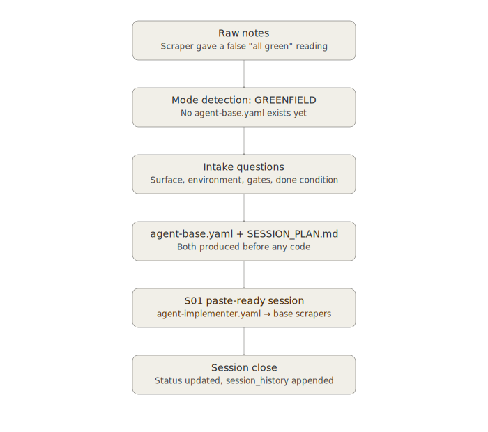

# Session Preflight walkthrough — from raw notes to a paste-ready session

A constraint-kit scenario demonstrating `session-preflight` end to end:
raw, unstructured notes going in, and a complete `agent-base.yaml` /
`SESSION_PLAN.md` pair — with a paste-ready `agent-implementer.yaml`
block for the first session — coming out, before any code is written.

This uses a real project as its basis: a small status-page monitoring
script that needed to become modular. It was picked deliberately for
being simple and self-contained — one clear problem, one clear fix, no
multi-service architecture to track. The point is to see the *shape*
of the preflight process clearly, not to follow a complicated case.



## What you assemble before the session

Worth being direct about something: `session-preflight`'s own `SKILL.md`
doesn't specify a required raw-notes format or template — only that
notes can arrive "as either a file reference or pasted text." There's
no canonical `intake-notes.md` shape the way there is for, say, the
post-mortem synthesis workflow's `incident-inputs.md`. That's
deliberate — raw notes are supposed to be genuinely raw, not a form to
fill out — but it does mean there's nothing to hold up as "the"
recommended structure. What follows is simply what was actually typed,
shown as the input artifact it functionally is.

### `notes.md` (as pasted, unedited)

```markdown

I track availability of services we use as a simple metric derived
from whatsup.status.io.com, using python, requests, and beautifulsoup
to scrape the html. The current status normal/green didn't match
that of www.cloudflarestatus.com, which showed major disruptions and
outages. I would like to modularly build new scrapers for
www.cloudflarestatus.com and many other sites we use if our current
method is no longer accurate.

```

That's the entire input. No epics, no acceptance criteria, no file
list — just a working thing that gave a wrong answer, and a general
direction to fix it. This is the normal starting condition
`session-preflight` expects: *"Accept user notes as either a file
reference or pasted text... if notes are ambiguous or incomplete, ask
at most three clarifying questions before proceeding."*

## Mode detection

No `agent-base.yaml` exists anywhere for this project — it's a script
someone had been running, not a constraint-kit-managed one. That's the
**GREENFIELD** signal: both `agent-base.yaml` and `SESSION_PLAN.md` are
outputs of this session, produced from scratch.

## Intake questions

`session-preflight` asks all of these before producing anything —
not one at a time:

1. **Project name and location** — `status-page-scraper`, new repo.
2. **AI surface** — Claude, browser session (this was worked entirely
   in-chat, no IDE involved for the initial build).
3. **Done condition** — a modular scraper registry that can check
   multiple status pages independently and report per-service status,
   easy to extend with a new service in a few lines rather than a
   rewrite.
4. **Environment** — Python 3.11, `requests`, `beautifulsoup4`, `retry`
   for the fetch layer; no additional toolchain.
5. **Quality gates** — a test harness that actually hits each
   registered scraper and confirms it returns parseable data, since a
   silent parsing failure was the entire original problem.

Notice what's *not* in this list: nothing about a database, a UI, an
API. The done condition stayed narrow on purpose — that's the intake
step doing its job of keeping scope matched to what was actually
asked for, not growing it.

## Produced artifact 1: `agent-base.yaml`

```yaml

schema_version: "0.1.0"
project: status-page-scraper
role: engineer

environment:
  repo_path: /home/user/projects/status-page-scraper
  venv_activate: source .venv/bin/activate
  python_version: "3.11"
  toolchain:
    - requests
    - beautifulsoup4
    - retry
  quality_gates:
    - python3 test_scrapers.py

conventions:
  line_length: 100
  formatter: black
  linter: ruff

design_decisions:
  - date: "2025-11-18"
    decision: >
      Move from a single aggregator source (whatsup.status.io) to
      direct per-service scraping. The aggregator was returning
      stale/cached data that didn't match the actual status pages —
      confirmed by comparing Cloudflare's real status page against
      what the aggregator reported during a live outage.

session_plan:
  update_instructions: >
    After each session: update SESSION_PLAN.md (Status, Actual effort,
    Lessons), set Status ready for any newly unblocked sessions, and
    append a session_history entry here.

session_history: []

```

That `design_decisions` entry matters more than it might look —
it's the durable record of *why* this project exists at all. Without
it, a future session (or a future person) re-reading this repo would
just see "scraper framework," not "the previous approach was silently
wrong and here's the proof."

## Produced artifact 2: `SESSION_PLAN.md`

Scope split across two sessions — small enough that this easily could
have been one, but splitting the base framework from the entrypoint +
tests keeps each session's paste block focused on one concern:

```markdown

# Session plan: status-page-scraper

Source of truth for the session sequence. Each entry defines one
agent session. The `### agent-implementer.yaml` block under each
session is paste-ready — copy the entire fenced block and replace
the contents of `.constraint-kit/agent-implementer.yaml` to start
that session.

After each session completes:

1. Update `Actual effort` and add a `Lessons` bullet in this file
2. Add a `session_history` entry in `agent-base.yaml`
3. Update the session `Status` to `complete`

## Status key

- `complete` — session finished, output committed
- `ready` — prerequisites met, paste block ready to use
- `blocked` — waiting on a prior session
- `draft` — task definition needs refinement before running

## S01 — Base scraper framework

- Status: ready
- Mode: generating-code
- Estimated effort: 1 session
- Actual effort: (fill after session)
- Depends on: none
- Output: base_scraper.py, statuspage_scraper.py, scraper_registry.py
- Lessons: (fill after session)

### agent-implementer.yaml

​```yaml
extends: agent-base.yaml
schema_version: "0.1.0"
project: status-page-scraper
role: engineer
mode: generating-code
target: session-prompt

task: >
  Build the modular scraper framework: an abstract base class any
  status-page scraper implements, a concrete implementation for sites
  running the Atlassian Statuspage platform (this covers Cloudflare,
  GitHub, Duo, and most others without custom code per site), and a
  registry that holds multiple scraper instances and collects status
  from all of them in one pass.

constraints:
  - Fetch layer must retry on transient network failure (use the
    retry package) — the original failure mode was a scraper going
    silently stale, not just erroring loudly
  - One scraper's failure must not stop the others from reporting —
    catch and log per-scraper, don't let one bad site kill the run
  - Statuspage-platform sites (Cloudflare, GitHub, Duo) should share
    one concrete class parameterized by URL, not one class each

checklist:
  - "[ ] Read the current whatsup-only scraper before writing
        anything, to keep the existing output format intact"
  - "[ ] Write base_scraper.py: abstract base class with fetch +
        retry, and an abstract get_components method"
  - "[ ] Write statuspage_scraper.py: one concrete class for
        Atlassian Statuspage-platform sites, parameterized by URL"
  - "[ ] Write scraper_registry.py: register/get/collect-all,
        catching and logging per-scraper failures"
  - "[ ] Run quality gates: python3 test_scrapers.py — must pass
        clean"
  - "[ ] Update SESSION_PLAN.md: set Status complete, fill
        Actual effort, add Lessons if applicable, set Status
        ready for any newly unblocked sessions"
  - "[ ] Append session summary to session_history in
        agent-base.yaml"
​```

## S02 — Entrypoint, tests, and Cloudflare/GitHub/Duo registration

- Status: blocked
- Mode: generating-code
- Estimated effort: 1 session
- Actual effort: (fill after session)
- Depends on: S01
- Output: statusio_modular.py, test_scrapers.py
- Lessons: (fill after session)

### agent-implementer.yaml

​```yaml
extends: agent-base.yaml
schema_version: "0.1.0"
project: status-page-scraper
role: engineer
mode: generating-code
target: session-prompt

task: >
  Build the entrypoint script and test harness. The entrypoint must
  be a drop-in replacement for the original single-source script —
  same Splunk payload format — but backed by the new registry.
  Register Cloudflare, GitHub, and Duo (all Statuspage-platform) plus
  the original whatsup.status.io source for side-by-side comparison
  during rollout.

constraints:
  - Splunk HEC payload format must not change — this is a drop-in
    replacement, not a new integration
  - Keep the original whatsup scraper registered alongside the new
    direct scrapers during rollout, so the two can be compared before
    the old source is retired
  - Test harness must actually fetch each registered scraper live,
    not mock the network — the bug this project fixes was a silent
    parsing failure, and a mocked test would not have caught it

checklist:
  - "[ ] Write statusio_modular.py: builds the default registry,
        collects all statuses, sends to Splunk in the existing
        format"
  - "[ ] Write test_scrapers.py: live-fetch test for every
        registered scraper, fail loudly on parse errors"
  - "[ ] Run quality gates: python3 test_scrapers.py — must pass
        clean against live status pages"
  - "[ ] Update SESSION_PLAN.md: set Status complete, fill
        Actual effort, add Lessons if applicable"
  - "[ ] Append session summary to session_history in
        agent-base.yaml"
​```

```

The final two checklist items are mandatory in every session block —
this is what makes `SESSION_PLAN.md` and `agent-base.yaml` a living
record instead of a plan that goes stale the moment work starts.

## What S01 actually produced

The real session output — this is genuine code from that build, not
a fabricated example:

```python

# base_scraper.py — abstract base class for all scrapers

from abc import ABC, abstractmethod
from typing import List, Dict, Optional
import logging
import requests
from bs4 import BeautifulSoup
from retry import retry

class StatusPageScraper(ABC):
    """Abstract base class for status page scrapers"""

    def __init__(self, url: str, timeout: int = 10):
        self.url = url
        self.timeout = timeout
        self.logger = logging.getLogger(self.__class__.__name__)

    @retry(requests.exceptions.RequestException, tries=3, delay=2)
    def fetch_page(self) -> BeautifulSoup:
        """Fetch and parse the status page"""
        response = requests.get(self.url, timeout=self.timeout)
        response.raise_for_status()
        return BeautifulSoup(response.content, "html.parser")

    @abstractmethod
    def get_components(self) -> List[Dict[str, any]]:
        """Extract component status information"""
        ...

```

Note the `retry` decorator and the abstract `get_components` method —
both trace directly back to constraints in the S01 paste block, not
something the agent decided on its own initiative. That's the
constraint doing its job: turning "must retry on transient failure"
into an actual decorator on the actual fetch method, not a suggestion
that might or might not get implemented.

## Session close

The two mandatory checklist items in the S01 paste block
(`SESSION_PLAN.md` update, `session_history` append) are the minimum
`session-preflight` requires of every session block. But the actual
close mechanics — what happens turn by turn as the session ends — are
owned by `session-hygiene`, not `session-preflight`. Its wrap-up
protocol has seven steps, triggered here by "all tasks complete."
Walking all seven against this project, in the order they're actually
executed:

**1. Complete the current atomic task only.** The last checklist item
in progress was running `test_scrapers.py` against live status pages.
That finishes before wrap-up starts — no new task begins once
completion is in sight.

**2. Finalize the session ledger.** The ledger `session-hygiene`
initialized at session open (see its `SKILL.md` §1) gets its closing
update — every task line marked complete, final budget estimate
recorded, no blocked items to note:

```markdown

## Session Ledger — S01

### Tasks

- [x] Write base_scraper.py
- [x] Write statuspage_scraper.py
- [x] Write scraper_registry.py
- [x] Run test_scrapers.py — passed clean

### Budget

estimated_consumed: 41%

```

**3. Update `SESSION_PLAN.md`.** S01's status line changes:

```markdown

- Status: complete
- Actual effort: 1 session
- Lessons: Statuspage-platform detection via `data-component-id`
  attributes covers Cloudflare, GitHub, and Duo with one class —
  worth checking for this attribute before writing a custom scraper
  for any new service.

```

And S02's status flips from `blocked` to `ready`, since its one
dependency is now satisfied.

**4. Append session history to `agent-base.yaml`.**

```yaml

session_history:
  - session_id: S01
    date: "2025-11-18"
    tasks_completed: 3
    tasks_carried_forward: 0
    budget_consumed_estimate: 41%
    notes: >
      Built base_scraper.py, statuspage_scraper.py, and
      scraper_registry.py. Confirmed the Statuspage-platform
      detection pattern (data-component-id) works identically for
      Cloudflare, GitHub, and Duo without per-site custom code.
      test_scrapers.py passes against all three live.

```

**5. Commit, if on a file-access surface.** This session ran in a
browser chat surface with no direct file access, so this step is
skipped rather than faked — `session-hygiene` is explicit that a
browser-chat surface states "this is a proposed change only" instead
of claiming a commit happened. On a file-access surface (Claude Code,
Copilot agent mode), this step would run
`git add -A && git commit -m "S01: base scraper framework"` and state
the resulting hash.

**6. Produce the continuation prompt.** A ready-to-paste block for
starting the next session:

```text

Continuing status-page-scraper — session S02.
Active plan: SESSION_PLAN.md.
Paste the S02 agent-implementer.yaml block from SESSION_PLAN.md as
your first message to begin.

```

**7. State wrap-up complete.** No further output after this point —
the session ends here, not with a trailing "let me know if you'd like
anything else."

Nothing here requires re-deriving what happened by reading through
chat history — the next session (or the next person) opens two files,
pastes the continuation prompt's referenced block, and knows exactly
what exists, what's next, and why.

## What this illustrates

- **Raw notes are enough to start.** No pre-formatted ticket, no
  epic breakdown — a paragraph describing a real, specific problem
  was sufficient input for `session-preflight` to work from.
- **There's no required raw-notes template, and that's intentional.**
  Unlike the post-mortem workflow's `incident-inputs.md`,
  `session-preflight` doesn't mandate a shape for the input — genuinely
  raw notes are the expected starting condition, not a form to fill
  out first.
- **The done condition stayed narrow.** Nothing crept in about a
  dashboard, a database, or a UI — the intake step matched scope to
  what was actually asked for.
- **Constraints in the paste block became real code.** The retry
  decorator and per-scraper error isolation weren't agent
  improvisation — they were requirements stated in `constraints:`
  that show up verbatim in the implementation.
- **Session close is seven steps, not two.** The mandatory checklist
  items in a `SESSION_PLAN.md` paste block are the floor
  `session-preflight` enforces — the full close, including the
  atomic-task boundary, the ledger finalization, the commit-or-honest-
  skip, and the continuation prompt, is `session-hygiene`'s protocol,
  and skipping any of it is exactly what leaves the next session
  starting blind.
