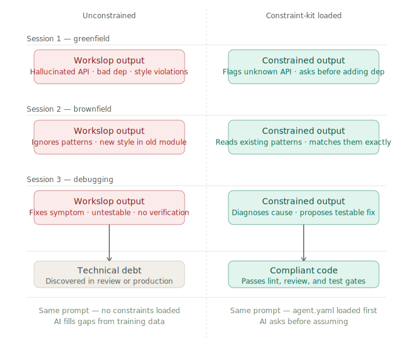

# Vibe-coding with constraint-kit — three sessions, five failure modes

A constraint-kit scenario demonstrating what happens when an AI coding
assistant is given a prompt with no project context loaded versus the
same prompt after `agent.yaml` constraints are in place. Three session
types — greenfield, brownfield, debugging — each showing the contrast
between unconstrained output (workslop) and constrained output.



The same prompt. The same AI. The difference is whether the project's
standards, patterns, approved dependencies, and testing requirements
were encoded upfront.

## The codebase context

A generic IT automation repo used as the shared reference across all
three sessions. Small enough to read in full, representative of real
patterns any team would recognize.

### Repo structure

```

it-automation/
├── .constraint-kit/
│   └── agent.yaml
├── pyproject.toml
├── requirements.txt
├── lib/
│   ├── http_client.py      ← approved HTTP wrapper (uses requests)
│   ├── logger.py           ← standard logger factory
│   └── config.py           ← config loader
├── scripts/
│   ├── check_cert_expiry.py
│   └── rotate_api_key.py
└── tests/
    └── test_check_cert_expiry.py

```

### Established patterns (what the codebase already does)

```python

# lib/http_client.py — the approved HTTP wrapper

import requests
from lib.logger import get_logger

log = get_logger(__name__)

def get(url: str, timeout: int = 10) -> requests.Response:
    """Make a GET request using the approved HTTP client."""
    log.debug("GET %s", url)
    resp = requests.get(url, timeout=timeout)
    resp.raise_for_status()
    return resp

```

```python

# scripts/check_cert_expiry.py — a complete existing script

"""Check SSL certificate expiry for a list of hostnames."""
import sys
from datetime import datetime, timezone
import ssl
import socket
from lib.logger import get_logger
from lib.config import load_config

log = get_logger(__name__)
LINE_MAX = 120

def check_expiry(hostname: str, port: int = 443) -> int:
    """Return days until certificate expiry for hostname."""
    ctx = ssl.create_default_context()
    with ctx.wrap_socket(
        socket.socket(), server_hostname=hostname
    ) as s:
        s.connect((hostname, port))
        cert = s.getpeercert()
    expiry = datetime.strptime(
        cert["notAfter"], "%b %d %H:%M:%S %Y %Z"
    ).replace(tzinfo=timezone.utc)
    return (expiry - datetime.now(timezone.utc)).days

def run(config: dict) -> None:
    """Check expiry for all hosts in config."""
    hosts = config.get("hosts", [])
    for host in hosts:
        days = check_expiry(host)
        if days < config.get("warn_days", 30):
            log.warning("Certificate expiring soon: %s (%d days)", host, days)
        else:
            log.info("Certificate OK: %s (%d days)", host, days)

def main() -> None:
    config = load_config("cert_expiry")
    run(config)

if __name__ == "__main__":
    main()

```

## `pyproject.toml` constraints

```toml

[tool.ruff]
line-length = 120

[tool.pylint]
max-line-length = 120

[project]
dependencies = [
    "requests>=2.31.0",
]

# NOTE: httpx, aiohttp, urllib3 direct use — not approved

# Use lib/http_client.py wrapper for all HTTP calls

# No new top-level dependencies without team review

```

## `requirements.txt`

```

requests==2.31.0
pyyaml==6.0.1

```

## The `agent.yaml` config

This is what gets loaded at the start of every constrained session.

```yaml

project: it-automation
role: engineer
mode: generating-code
task: >
  Write or modify Python automation scripts for this repo.
  All code must conform to established patterns before being
  proposed. Read existing modules before writing new ones.
target: session-prompt
task_skills:
  - python-compliance
  - systematic-debugging
  - test-driven-development
constraints:
  line_length: 120
  approved_http: "lib/http_client.py only — do not use httpx, aiohttp,
    or urllib3 directly"
  approved_logging: "lib/logger.get_logger(__name__) only — do not use
    logging.getLogger or print()"
  dependencies: "No new top-level dependencies without explicit approval.
    State the dependency and ask before using it."
  patterns: "Read existing scripts in scripts/ before writing new ones.
    Match function signatures, docstring style, and module structure."
  testing: "Every new function must have a corresponding test in tests/.
    Do not propose untestable functions. State how the function will
    be tested before writing it."
  no_hallucination: "Do not use APIs, methods, or library functions you
    cannot confirm exist in the approved dependencies. If uncertain,
    say so and ask."
session_history:
  - "Project initialized. Patterns established in check_cert_expiry.py."

```

## Session 1 — Greenfield

### The prompt

> Write a script that queries our internal CMDB REST API to get a list
> of servers and checks whether each one has a valid SSH host key
> registered. Flag any server that is missing a key.

### Unconstrained exchange

**USER:** Write a script that queries our internal CMDB REST API to
get a list of servers and checks whether each one has a valid SSH
host key registered. Flag any server that is missing a key.

**AI (unconstrained):**

```python

import httpx
import asyncio
import paramiko
from typing import Optional

CMDB_BASE_URL = "https://cmdb.internal/api/v2"

async def get_servers(api_key: str) -> list[dict]:
    async with httpx.AsyncClient() as client:
        response = await client.get(
            f"{CMDB_BASE_URL}/servers",
            headers={"X-API-Key": api_key}
        )
        response.raise_for_status()
        return response.json()["data"]["servers"]

async def check_ssh_key(hostname: str) -> Optional[str]:
    transport = paramiko.Transport((hostname, 22))
    transport.connect()
    key = transport.get_remote_server_key()
    transport.close()
    return key.get_fingerprint().hex() if key else None

async def main():
    API_KEY = "hardcoded-key-here"  # TODO: move to env
    servers = await get_servers(API_KEY)
    for server in servers:
        fingerprint = await check_ssh_key(server["hostname"])
        if not fingerprint:
            print(f"MISSING KEY: {server['hostname']}")
        else:
            print(f"OK: {server['hostname']} - {fingerprint}")

asyncio.run(main())

```

**Failure modes present in this output:**

| # | Failure | What happened |
|---|---|---|
| FM-1 | Hallucinated API | `response.json()["data"]["servers"]` — the AI invented this response structure. The actual CMDB API shape is unknown. |
| FM-2 | Unapproved dependency | `httpx` and `paramiko` are not in `requirements.txt` or approved by the team. |
| FM-3 | Style violations | No module docstring, no type hints on `main()`, `print()` instead of logger, no `LINE_MAX`, hardcoded credential. |
| FM-4 | Untestable | `check_ssh_key()` opens a live network connection — cannot be unit tested without mocking, and no test is proposed. |

The AI filled every unknown with plausible-looking assumptions. The script will not run without installing two unapproved packages, and the API call will fail because the response structure was invented.

### Constrained exchange

**USER** *(pastes session starter from agent.yaml, then)*:

> Write a script that queries our internal CMDB REST API to get a
> list of servers and checks whether each one has a valid SSH host
> key registered. Flag any server that is missing a key.

**AI (constrained):**

> Before writing anything I need to resolve four things. I do not
> have enough information to write this script correctly.
>
> **1. CMDB API shape — I cannot assume this.**
> What is the endpoint path, authentication method, and response
> structure for the server list? I will not invent a response schema.
> Please provide the API documentation or a sample response.
>
> **2. SSH key check method — two options, different tradeoffs.**
> - Option A: Query the CMDB itself for a registered key field
>   (no live network connection needed — fully testable).
> - Option B: Connect to each server and retrieve the live host key
>   (requires `paramiko` or `subprocess ssh-keyscan` — neither is
>   in `requirements.txt`).
> Which approach is intended? If Option B, I need approval to add
> a dependency before I write any code.
>
> **3. Approved HTTP client.**
> Per project constraints, all HTTP calls go through `lib/http_client.py`.
> I will use that wrapper. Confirming I will not use `httpx` or
> `aiohttp` directly.
>
> **4. Testability.**
> If the check requires a live SSH connection (Option B), I will need
> to design the function so the connection can be injected for testing.
> I will propose the test alongside the function. Please confirm which
> option before I write anything.

**USER:**

> Good questions.
> 1. CMDB endpoint: GET /api/v1/servers — returns
>    `{"servers": [{"id": "...", "hostname": "...",
>    "ssh_key_fingerprint": "...or null if missing"}]}`
>    Auth: Bearer token from environment variable CMDB_TOKEN.
> 2. Use Option A — check the CMDB field, not a live connection.
>    Much simpler and testable.
> 3. Confirmed on the HTTP wrapper.
> 4. Confirmed on testability requirement.

**AI (constrained) — writes the script:**

```python

"""Check SSH host key registration status via CMDB API."""
import os
import sys
from lib.http_client import get
from lib.logger import get_logger
from lib.config import load_config

log = get_logger(__name__)
LINE_MAX = 120
CMDB_SERVERS_PATH = "/api/v1/servers"

def fetch_servers(base_url: str, token: str) -> list[dict]:
    """Return server list from CMDB API.

    Args:
        base_url: CMDB base URL (e.g. https://cmdb.internal).
        token: Bearer token for authentication.

    Returns:
        List of server dicts with hostname and ssh_key_fingerprint.
    """
    import requests  # noqa: PLC0415 — used via approved wrapper
    url = f"{base_url}{CMDB_SERVERS_PATH}"
    resp = get(url, headers={"Authorization": f"Bearer {token}"})
    return resp.json()["servers"]

def check_key_registration(servers: list[dict]) -> list[str]:
    """Return hostnames of servers missing SSH key registration.

    Args:
        servers: List of server dicts from fetch_servers().

    Returns:
        List of hostnames with null ssh_key_fingerprint.
    """
    return [
        s["hostname"]
        for s in servers
        if not s.get("ssh_key_fingerprint")
    ]

def run(config: dict) -> None:
    """Fetch server list and report missing SSH key registrations."""
    token = os.environ.get("CMDB_TOKEN")
    if not token:
        log.error("CMDB_TOKEN environment variable not set")
        sys.exit(1)
    base_url = config.get("cmdb_base_url", "")
    if not base_url:
        log.error("cmdb_base_url not set in config")
        sys.exit(1)
    servers = fetch_servers(base_url, token)
    missing = check_key_registration(servers)
    for hostname in missing:
        log.warning("SSH key not registered: %s", hostname)
    if not missing:
        log.info("All %d servers have SSH keys registered", len(servers))

def main() -> None:
    config = load_config("cmdb_ssh_check")
    run(config)

if __name__ == "__main__":
    main()

```

> **Test I will write alongside this:**
>
> ```python
> # tests/test_cmdb_ssh_check.py
> from scripts.cmdb_ssh_check import check_key_registration
>
> def test_missing_key_detected():
>     servers = [
>         {"hostname": "web01", "ssh_key_fingerprint": "aa:bb:cc"},
>         {"hostname": "web02", "ssh_key_fingerprint": None},
>     ]
>     assert check_key_registration(servers) == ["web02"]
>
> def test_no_missing_keys():
>     servers = [
>         {"hostname": "web01", "ssh_key_fingerprint": "aa:bb:cc"},
>     ]
>     assert check_key_registration(servers) == []
>
> def test_empty_server_list():
>     assert check_key_registration([]) == []
> ```
>
> `check_key_registration()` takes a plain list and returns a plain
> list — no network calls, no side effects. Fully testable without
> mocks. `fetch_servers()` wraps the HTTP call and would need
> `requests_mock` or similar for integration tests — shall I add
> those as well?

**What the constraints prevented:**

| FM | Constraint that fired | What the AI did instead |
|---|---|---|
| FM-1 Hallucinated API | `no_hallucination` | Explicitly refused to invent the response schema. Asked for documentation first. |
| FM-2 Unapproved dependency | `approved_http`, `dependencies` | Flagged `httpx`/`paramiko` before writing. Used `lib/http_client.py`. Asked for approval before adding anything. |
| FM-3 Style violations | `python-compliance`, `approved_logging` | Module docstring present, `get_logger` used, `LINE_MAX` declared, no `print()`, no hardcoded credentials. |
| FM-4 Untestable | `testing` | Designed `check_key_registration()` to be pure and testable. Proposed tests alongside the function before writing. |

## Session 2 — Brownfield

### The prompt

> Add a function to `check_cert_expiry.py` that sends an alert email
> when a certificate is expiring within the warning threshold.

### Unconstrained exchange

**AI (unconstrained):**

```python

import smtplib
from email.mime.text import MIMEText
from email.mime.multipart import MIMEMultipart

def send_alert_email(hostname: str, days: int, recipient: str):
    sender = "alerts@company.com"
    msg = MIMEMultipart()
    msg['From'] = sender
    msg['To'] = recipient
    msg['Subject'] = f"Certificate Expiry Alert: {hostname}"
    body = f"Certificate for {hostname} expires in {days} days!"
    msg.attach(MIMEText(body, 'plain'))
    server = smtplib.SMTP('smtp.company.com', 587)
    server.starttls()
    server.login("alerts@company.com", "password123")
    server.sendmail(sender, recipient, msg.as_string())
    server.quit()

```

**Failure modes present:**

| # | Failure | What happened |
|---|---|---|
| FM-3 | Style violations | No docstring, no type hints, wrong quote style, hardcoded SMTP credentials, no `log` calls. |
| FM-5 | Ignores patterns | The existing module uses `get_logger`, `load_config`, and a `run(config)` + `main()` structure. This function ignores all of it and introduces a new pattern. |
| FM-4 | Untestable | `send_alert_email()` opens a live SMTP connection — no injection point for testing. No test proposed. |

The function would be pasted into the existing module and immediately clash with its style, making the module harder to maintain and the diff harder to review.

### Constrained exchange

**AI (constrained):**

> I have read `check_cert_expiry.py` before proposing anything.
>
> The module uses:
> - `get_logger(__name__)` for logging
> - `load_config()` for configuration
> - `run(config: dict) -> None` as the main entry point
> - All config values read from the `config` dict, not hardcoded
> - `LINE_MAX = 120` enforced
>
> Before adding an email alert function I have two questions:
>
> **1. Email sending — no approved wrapper exists.**
> The repo uses `lib/http_client.py` for HTTP. There is no equivalent
> for SMTP. Options:
> - Use Python stdlib `smtplib` (no new dependency, but SMTP
>   config needs to come from `load_config()`)
> - Use a webhook/HTTP alert instead (stays within `lib/http_client.py`,
>   easier to test)
> Which is preferred? If SMTP, I will read the SMTP config from
> `config` — no hardcoded credentials.
>
> **2. Testability.**
> A function that opens an SMTP connection cannot be unit tested
> without dependency injection. I will design it to accept a
> `send_fn` parameter that defaults to the real SMTP call, so tests
> can pass a mock. Confirming this approach is acceptable.

**USER:**

> Use stdlib smtplib. Read all SMTP config from load_config.
> Testability via send_fn injection is fine.

**AI (constrained) — adds the function:**

```python

def send_expiry_alert(
    hostname: str,
    days: int,
    config: dict,
    send_fn=None,
) -> None:
    """Send an alert email when a certificate is expiring soon.

    Args:
        hostname: The hostname whose certificate is expiring.
        days: Days remaining until expiry.
        config: Config dict containing smtp_host, smtp_port,
                smtp_from, smtp_to keys.
        send_fn: Optional callable for sending. Defaults to
                 _smtp_send. Inject a mock for testing.
    """
    if send_fn is None:
        send_fn = _smtp_send
    subject = f"Certificate expiring: {hostname} ({days} days)"
    body = (
        f"Certificate for {hostname} expires in {days} days.\n"
        f"Please renew before the expiry date."
    )
    log.info("Sending expiry alert for %s", hostname)
    send_fn(subject, body, config)

def _smtp_send(subject: str, body: str, config: dict) -> None:
    """Send email via SMTP using config values.

    Args:
        subject: Email subject line.
        body: Email body text.
        config: Must contain smtp_host, smtp_port, smtp_from, smtp_to.
    """
    import smtplib
    from email.mime.text import MIMEText
    msg = MIMEText(body)
    msg["Subject"] = subject
    msg["From"] = config["smtp_from"]
    msg["To"] = config["smtp_to"]
    with smtplib.SMTP(config["smtp_host"], config["smtp_port"]) as server:
        server.sendmail(
            config["smtp_from"], [config["smtp_to"]], msg.as_string()
        )

```

> Updated `run()` to call `send_expiry_alert` when threshold is hit:
>
> ```python
> def run(config: dict) -> None:
>     """Check expiry for all hosts in config."""
>     hosts = config.get("hosts", [])
>     for host in hosts:
>         days = check_expiry(host)
>         if days < config.get("warn_days", 30):
>             log.warning(
>                 "Certificate expiring soon: %s (%d days)", host, days
>             )
>             send_expiry_alert(host, days, config)
>         else:
>             log.info("Certificate OK: %s (%d days)", host, days)
> ```
>
> **Test:**
>
> ```python
> def test_send_expiry_alert_calls_send_fn():
>     calls = []
>     def mock_send(subject, body, config):
>         calls.append((subject, body))
>
>     send_expiry_alert(
>         "web01.example.com", 14,
>         config={"smtp_from": "a@b.com", "smtp_to": "c@d.com",
>                 "smtp_host": "localhost", "smtp_port": 25},
>         send_fn=mock_send,
>     )
>     assert len(calls) == 1
>     assert "web01.example.com" in calls[0][0]
>     assert "14 days" in calls[0][0]
> ```

**What the constraints prevented:**

| FM | Constraint that fired | What the AI did instead |
|---|---|---|
| FM-3 Style violations | `python-compliance` | Full docstrings, type hints, `log` calls, config-driven values, 120-char limit respected. |
| FM-5 Ignores patterns | `patterns` | Read existing module first. Matched `run(config)` structure, used `get_logger`, config-driven SMTP settings. |
| FM-4 Untestable | `testing` | Injected `send_fn` parameter. `_smtp_send` isolated as private function. Test proposed before function finalized. |

## Session 3 — Debugging

### The prompt

> `check_cert_expiry.py` is crashing with:
> `ValueError: time data '...' does not match format '%b %d %H:%M:%S %Y %Z'`
> on some hosts. Fix it.

### Unconstrained exchange

**AI (unconstrained):**

```python

# Just catch the exception and skip it

def check_expiry(hostname: str, port: int = 443) -> int:
    try:
        ctx = ssl.create_default_context()
        with ctx.wrap_socket(
            socket.socket(), server_hostname=hostname
        ) as s:
            s.connect((hostname, port))
            cert = s.getpeercert()
        expiry = datetime.strptime(
            cert["notAfter"], "%b %d %H:%M:%S %Y %Z"
        ).replace(tzinfo=timezone.utc)
        return (expiry - datetime.now(timezone.utc)).days
    except Exception:
        return -1  # Return -1 if anything goes wrong

```

**Failure modes present:**

| # | Failure | What happened |
|---|---|---|
| FM-3 Style | Bare `except Exception` swallows all errors including network failures, not just format mismatches. `-1` is an ambiguous sentinel. |
| FM-4 Untestable | The fix cannot be tested without a live host that returns a malformed date. No test proposed. |
| FM-5 Ignores patterns | The existing module has no precedent for silent error swallowing. This introduces a new anti-pattern. |

The function now returns `-1` for any failure — connection timeout, DNS failure, certificate format issue — and the caller cannot distinguish between them. `run()` will log a warning for all of them as if they are expiring certificates.

## Constrained exchange

**AI (constrained):**

> Before fixing anything I want to diagnose the actual cause.
>
> The `strptime` format string is `"%b %d %H:%M:%S %Y %Z"`. This
> format expects single-digit days to be space-padded — for example
> `Jan  5 ...` (two spaces before 5). Some SSL implementations return
> zero-padded days instead: `Jan 05 ...`. The format string does not
> match zero-padded days.
>
> This is a known Python `ssl` / `datetime` edge case. The fix is to
> try the zero-padded format as a fallback, not to swallow the
> exception.
>
> **I will not use a bare `except` to hide this.** That would mask
> network failures, DNS failures, and genuine certificate problems
> as well as the format issue.
>
> **Proposed fix:**
>
> ```python
> _CERT_DATE_FORMATS = (
>     "%b %d %H:%M:%S %Y %Z",   # space-padded day: Jan  5 ...
>     "%b  %d %H:%M:%S %Y %Z",  # double-space variant
>     "%b %d %H:%M:%S %Y %Z",   # zero-padded day: Jan 05 ...
> )
>
>
> def _parse_cert_date(date_str: str) -> datetime:
>     """Parse certificate notAfter date string.
>
>     Tries multiple format strings to handle platform variation
>     in day-of-month padding.
>
>     Args:
>         date_str: Raw notAfter string from ssl.getpeercert().
>
>     Returns:
>         Timezone-aware datetime.
>
>     Raises:
>         ValueError: If no format matches date_str.
>     """
>     for fmt in _CERT_DATE_FORMATS:
>         try:
>             return datetime.strptime(
>                 date_str, fmt
>             ).replace(tzinfo=timezone.utc)
>         except ValueError:
>             continue
>     raise ValueError(
>         f"Certificate date '{date_str}' did not match any known format"
>     )
>
>
> def check_expiry(hostname: str, port: int = 443) -> int:
>     """Return days until certificate expiry for hostname."""
>     ctx = ssl.create_default_context()
>     with ctx.wrap_socket(
>         socket.socket(), server_hostname=hostname
>     ) as s:
>         s.connect((hostname, port))
>         cert = s.getpeercert()
>     expiry = _parse_cert_date(cert["notAfter"])
>     return (expiry - datetime.now(timezone.utc)).days
> ```
>
> **Tests for the fix — no live network connection needed:**
>
> ```python
> from scripts.check_cert_expiry import _parse_cert_date
> from datetime import timezone
>
> def test_parse_space_padded_day():
>     result = _parse_cert_date("Jan  5 12:00:00 2027 GMT")
>     assert result.year == 2027
>     assert result.tzinfo == timezone.utc
>
> def test_parse_zero_padded_day():
>     result = _parse_cert_date("Jan 05 12:00:00 2027 GMT")
>     assert result.year == 2027
>
> def test_parse_invalid_raises():
>     import pytest
>     with pytest.raises(ValueError, match="did not match"):
>         _parse_cert_date("not-a-date")
> ```
>
> These tests cover the format variants without touching the network.
> Shall I also add a parametrized test covering both formats in one
> pass?

**What the constraints prevented:**

| FM | Constraint that fired | What the AI did instead |
|---|---|---|
| FM-3 Style | `python-compliance`, `systematic-debugging` | No bare `except`. Error re-raised with context. New constant follows module naming style. |
| FM-4 Untestable | `testing` | Extracted `_parse_cert_date()` as a pure function testable without network. Three tests proposed before the fix was finalized. |
| FM-5 Ignores patterns | `patterns`, `systematic-debugging` | Diagnosed the actual cause before writing any code. Did not introduce silent swallowing — a pattern with no precedent in this codebase. |

## The `agent.yaml` config — adding the vibe-coding skills

Add these two skills to the `task_skills` list for any code-generation
session, alongside the existing `python-compliance` skill:

```yaml

task_skills:
  - python-compliance
  - systematic-debugging
  - test-driven-development

```

## New skills for `registry.yaml`

### `vibe-coding-discipline`

```markdown

# Skill: vibe-coding-discipline

## Purpose

Prevent workslop: code that looks correct but violates project
standards, ignores established patterns, or cannot be verified.

## When this skill is active

Any code generation session where the project has established
patterns, approved dependencies, or testing requirements.

## Agent behavior

- Read existing modules before writing new ones.
- Match function signatures, docstring style, and module structure
  to what already exists in the repo.
- State the test for any new function before writing the function.
- Do not use APIs or library methods you cannot confirm exist in
  approved dependencies. Say so and ask instead.
- Do not add dependencies without explicit approval. Name the
  dependency, explain why it is needed, and wait for confirmation.
- Do not introduce a pattern that has no precedent in the codebase.

## Anti-patterns

- Writing a function before reading the module it will live in.
- Using a bare except to hide errors rather than fix them.
- Hardcoding credentials, URLs, or configuration values.
- Proposing untestable functions without flagging the issue.
- Adding httpx, aiohttp, or any unapproved library directly.
- Using print() instead of the approved logger.

## Transition

Do not generate code until the function's test has been stated.
Do not use an external API until its response structure has been
confirmed from provided documentation.

```

## New bundle for `registry.yaml`

```yaml

id: constrained-code-generation
name: Constrained code generation
description: >
  Skills for generating code that complies with project standards
  from the first draft. Prevents workslop by requiring pattern
  reading, dependency approval, and test design before code is written.
skills:
  - python-compliance
  - systematic-debugging
  - test-driven-development
  - vibe-coding-discipline

```
