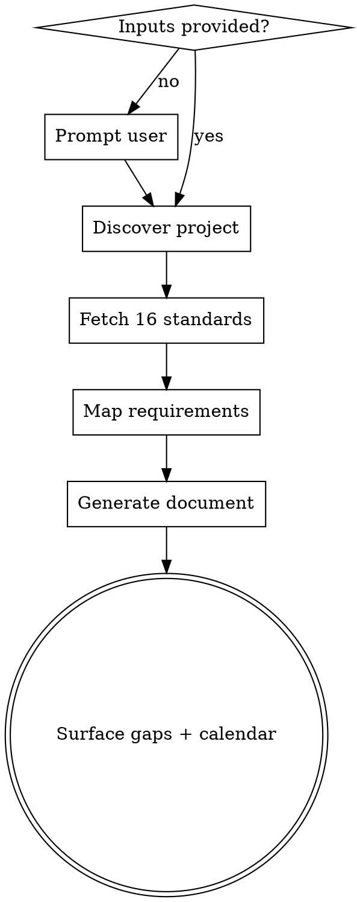

# UMN Security Compliance Analysis

## Overview

Generate a comprehensive security compliance document for a University
of Minnesota project by mapping the project's technology stack and
design against the 16 UMN Information Security Policy Standards. Each
policy requirement is categorized as **Compliant**, **Design Change
Needed**, **Procedural**, or **Not Applicable**, with concrete
project-specific evidence.

Use the same skill for the initial review and for the recurring annual
review — only the prior document and the change set differ.

**Announce at start:** "I'm using the umn-security-compliance skill to
run the compliance analysis."

## When to Use

- Initial security review for a new UMN project before deployment
- Annual compliance review of an existing UMN project
- After a major architectural change (new service, new data flow, new dependency)
- Pre-deployment security assessment when the user mentions "UMN security policy", "secure data policy", "data classification", or "compliance review"

## When NOT to Use

- Projects unrelated to the University of Minnesota — use generic security review approaches
- Everyday secure-coding decisions — that is the `security-principles` skill (constraint-dev plugin); this skill is the periodic analysis process, not the per-task discipline
- Code-level vulnerability scanning (use TVM tooling — this skill points to it but does not run scans)
- General Azure/AWS security best practices (use the relevant cloud-provider skill)
- Reviewing only a single subsystem in isolation — this skill produces a project-wide compliance picture

## Required Inputs (PROMPT IF MISSING)

Before doing any analysis, you MUST have BOTH of these. **If either is
missing, stop and ask the user before continuing.**

1. **Data Classification** — one of:
   - `Public`
   - `Private-Restricted`
   - `Private-Highly Restricted`

2. **Security Level** — one of:
   - `Low`
   - `Medium`
   - `High`

Reference: https://policy.umn.edu/it/dataclassification

**Check `.constraint-kit/PROJECT.md` Constraints first** — projects
onboarded with `project-intake` or `project-archaeology` may already
record both values there. If found, confirm once and reuse. Once the
user confirms values that are *not* yet recorded there, add them to
PROJECT.md Constraints so the next review (and every other skill)
inherits them.

**Prompt to use when missing:**

> Before I run the compliance analysis, please confirm two values:
>
> 1. **Data classification** — Public / Private-Restricted / Private-Highly Restricted
> 2. **Security level** — Low / Medium / High
>
> Reference: https://policy.umn.edu/it/dataclassification
>
> If unsure: most operational metrics, internal tooling, and team telemetry are Private-Restricted with Medium security. PII, FERPA, HIPAA, or PCI data are Private-Highly Restricted with High security.

Do not guess these values.

## Process

1. **Confirm inputs** — classification + security level + user-scope
   (single/multi-user). Check PROJECT.md Constraints, then ask for
   anything missing.
2. **Discover project** — start from what constraint-kit already
   knows: `.constraint-kit/PROJECT.md` (stack, constraints),
   `.constraint-kit/ARCHAEOLOGY.md` (structural inventory, data flows,
   flaw taxonomy — if the project was onboarded via
   project-archaeology), and recent specs/plans. Then read README,
   terraform/, deployment workflows, and use CodeGraph
   (`codegraph_explore`, or the `codegraph` CLI) for data flows,
   entry points, and service boundaries the docs don't cover. Build an
   inventory of: services used, data flows, identities, secrets,
   logging targets, backup locations, vendor dependencies.
3. **Fetch the 16 standards** — see `policy-standards.md` for the URL
   list. Use WebFetch (parallel where possible) to enumerate each
   standard's requirement IDs and texts.
4. **Map each requirement** — for every requirement ID, determine the disposition:
   - **Compliant** — evidence in the project clearly satisfies the requirement
   - **Design Change Needed** — gap that requires a code/config/policy change
   - **Procedural** — recurring operational task (annual review, training, monitoring)
   - **Not Applicable** — does not apply, with justification (delegated to vendor, no such surface, etc.)
5. **Generate the document** — follow `template.md`. Default output
   path: `docs/security-compliance.md` (ask user if a different path
   is preferred). Replace placeholders, omit empty subsections, cite
   specific resource names from the project.
6. **Surface design changes + annual calendar** — populate the "Design
   Changes Required" section with concrete code/config snippets, and
   confirm the Annual Compliance Calendar reflects this project's
   resources. Procedural items with a recurring cadence belong on the
   calendar; one-time gaps become design work (see Transitions).

## The 16 Policy Standards

Full list with URLs in `policy-standards.md`. Section ordering in the
output document is fixed:

1. AAAM — Authentication, Access, and Account Management
2. CM — Change Management
3. DCS — Data Center Security
4. DSBR — Data Storage and Backup & Recovery
5. E — Encryption
6. SA — Information Security Awareness, Education and Training
7. LM — Log Management
8. MS — Media Sanitization
9. NF — Network Firewall
10. NM — Network Management
11. SPM — Security Patch Management
12. SD — Software Development
13. SDM — Systems and Device Management
14. TVM — Technical Vulnerability Management
15. VSM — Vendor/Supplier Management
16. VPM — Virus/Malware Protection

## Output Document Structure

Use `template.md` in this skill directory as the output skeleton. Each
policy section uses up to four subsections (omit any that are empty
for that section):

| Subsection | Format | Purpose |
|---|---|---|
| Compliant | Table: ID, Requirement, How Addressed | Evidence that requirement is met |
| Design Change Needed | Table: ID, Requirement, Gap | Specific gap + recommended fix |
| Procedural (Annual/Recurring) | Table: ID, Requirement, Frequency, Procedure | Operational tasks tied to project resources |
| Not Applicable | Narrative paragraph OR table with Reason column | Justification for non-applicability |

The document MUST end with two summary sections:

1. **Design Changes Required** — collated list of all gaps with concrete code/config snippets (terraform, yaml, python, etc.)
2. **Annual Compliance Calendar** — month-by-month operational schedule referencing specific policy IDs

## Reference Example

A complete sample document for a Medium-Risk Multi-User Azure project
lives at `docs/superpowers/security-compliance.md` in the
`sre-itsi-azure-metrics` repo. Use it for tone, level of specificity,
and phrasing when filling out tables. The sample is the gold standard —
generic "industry best practice" entries are NOT acceptable; every row
should reference a real resource, repo, or process from the target
project.

## Quick Reference

| Item | Value |
|---|---|
| Policy hub | https://policy.umn.edu/it/securedata |
| Data classification | https://policy.umn.edu/it/dataclassification |
| Default output path | `docs/security-compliance.md` |
| Classification/level storage | `.constraint-kit/PROJECT.md` Constraints |
| Sample output | `docs/superpowers/security-compliance.md` (in sre-itsi-azure-metrics) |
| Standards list with URLs | `policy-standards.md` (in this skill dir) |
| Output template | `template.md` (in this skill dir) |

## Common Mistakes

| Mistake | Fix |
|---|---|
| Skipping classification confirmation | If classification or security level is missing, prompt before doing ANYTHING else. Do not guess. |
| Generic "industry best practice" rows | Every row must cite a specific project resource (terraform file, repo, MI name, vault name, etc.). |
| Listing every sub-requirement when standard is N/A | Use a single narrative paragraph for fully-N/A standards (DCS, MS, VPM are common). |
| Treating cloud-managed concerns as gaps | When the cloud provider manages the underlying control (physical security, OS patching, malware), document the delegation — don't list as a gap. |
| Missing the Design Changes Required summary | Always collate gaps at the end, with concrete snippets the team can pull into a PR. |
| Missing the Annual Compliance Calendar | Always include the month-by-month schedule. |
| Stale "Last Reviewed" date | Set to today's date in `YYYY-MM-DD` format. |
| Skipping fetch of policy appendices | Don't rely on memory — fetch each appendix to capture current requirement IDs and wording. |

## Red Flags — Stop and Re-check

- About to write the document without classification or security level → STOP, prompt user
- Tempted to write "All Azure best practices apply" → STOP, fetch the actual policy and cite specific IDs
- About to mark something Compliant without naming a project resource → STOP, find the resource or recategorize
- About to skip a standard because "it doesn't apply" → STOP, write a Not Applicable section with justification
- Using requirement IDs you didn't see in a fetched policy → STOP, fetch the policy first

## Transitions

- **Design Changes Required → the design pipeline.** The collated gaps
  are input for the `brainstorming` / `writing-plans` skills
  (constraint-design plugin): offer to hand the gap list to the
  planner agent so fixes become specced, planned tasks rather than a
  to-do list in a document.
- **Newly confirmed classification/security level →
  `.constraint-kit/PROJECT.md` Constraints**, so every other skill and
  the next annual review inherit them.
- **Annual calendar** — remind the user to wire the calendar into
  whatever scheduler the team uses; this skill produces the schedule,
  not the automation.

## File Index

- `SKILL.md` (this file) — Process and rules
- `policy-standards.md` — The 16 standards with their official URLs and the classification reference
- `template.md` — Output document skeleton with placeholders
